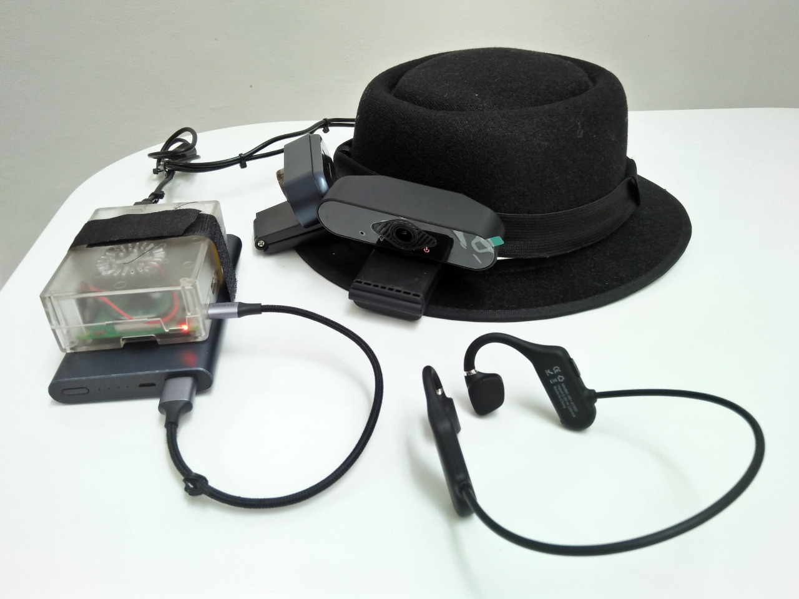
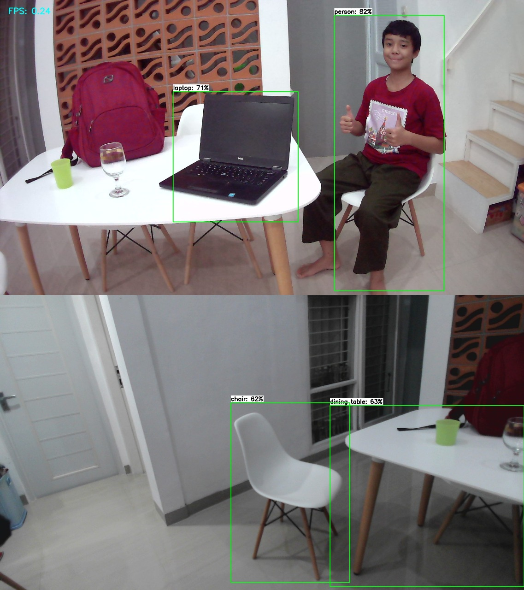

# vizhat-objectdetection
Object detection for VizHat, hat for blind people that uses real-time object detection to detect a blind person's surroundings.\
\

VizHat's webcams capture images which then will be processed by a RaspberryPi. If any object is detected,
it will tell the user the direction, distance, and amount, by a bone-conduction earphone. "Two person, near, on your right."
